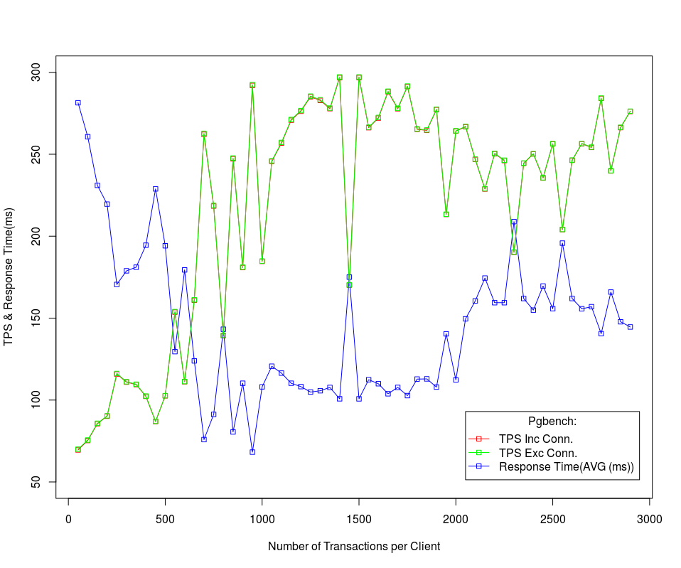

# pgbench & others: Benechmarking PostGreSQL Server #

**PostgreSQL** is a great RDBMS, cannot say enough good things. To ensure that one is getting everything possible from the system benchmarking is important, no it's critical. One needs to be able to show, study and predict behaviour, benchmarking is one method to accomplish this. This document describes the process of creating benchmarks, analysis of the results and methodologies for comparison. 

**PostgreSQL** is a solid datbase and functions very well under heavy load, it's **critical to understand the load on your paticular system**. There are many possible settings that can be tweaked to ***improve the peformance of PostgreSQL***, and the sytem in general. A subset of those settings are mentioned here, along with **pgbench** and how it can be used to assist with tuning. It should be noted that there is no "magic bullet" here, performance is a concept and the system may require multiple tunings as it grows. 


## Hardware Performance ##

Database processes do complicated operations on lots of data. Complicated operations (like comparing, grouping, hashing, joining, sorting, etc) require lots of processor time. Give your database lots of processor juice, dual processor minimum, high end of the price/performance ration (most GHz for least USD). Lots of data requires lots of storage, lots of operations means lots of reading and writing. This means 36 GB (minimum) SCSI on 180 or 320 bus; use 15K RPM if possible. Of course storing lots of data means, operating on lots of data. Operations take place in memory so there had better be enough, swapping will degrade performance. At the time of this writing a solid database machine for moderate load was a dual 3.0 GHz, 4GB RAM and hardware mirrored 73GB/SCSI320/15K.

Databases have a tendency to store mission critical data, so one needs to take precautions when storing. The first line of defence (after quality hardware vendors) is the storage array or RAID. The reader is expected to know what RAID0, RAID1 and RAID5 are. RAID0 is simply not suitable, do not use this for a database filesystem. RAID1 is is favoured by many over RAID5 for the datbase system, the arguments go something like: parallel writes vs read+parity-calc+write. The options that many consider the best is RAID10 which has the reliabilty of RAID1 with performance like RAID0. RAID10 highly reccomended even though it is the most expensive option. 

## Software Performance ##

The choice of performance hardware will be wasted if the software cannot or will not use it. To this end the operating system should have some performance tuning done to it if possible, an entire discussion itself. PostgreSQL is highly configurable and has many options to improve its performance, obviously consuming resources to do so. Of course hardware, OS and RDBMS tuning will be useless if the database schema and design are not also performance oriented. 

### 1. Tune the Operating System ###

Related to Linux:

***Shared Memory***

PostgreSQL uses lots of this, view ipcs to prove it, the more shared memory the better as more data (tables) can be loaded. On a dedicated database server it's not uncommon to give half the memory to the database. The shared memory maximum value can be set in /proc/sys/kernel/shmmax. Say echo $((`cat /proc/sys/kernel/shmmax` / 1048576)) to see how many megabytes are permitted for shared memory. Set this to half of the physical memory (or some reasonable value) echo $((1024 * 1024 * 1024)) > /proc/sys/kernel/shmmax, thats 1G. PostgreSQL will also have to be told to use this, see below. 

***File Atime***

Many of the file system choices have a file access time or atime attribute on the files. A slight performance increase can be found by turning this feature off for the database file system. For ext3 the entry in /etc/fstab should look something like: 

		/dev/sda4    /var    ext3    noatime    0    0

### 2. Tune PostgreSQL Performance ###

The values and suggestions expressed here are just that, it's basic rules that [Edoceo](http://edoceo.com/) uses, YMMV. As always one should experiment with what values work best for your environment. 

**max_connections = N**

Set this to 140% of the average number of expected connections. 100 clients average means 140 max connections.

**shared_buffers = N**

Set anywhere from 1/4 to 1/2 physical memory, must set kernel shared memory max first. Will see noticeable difference. These are calculated as 8K blocks so 256M would be 32768 = 1024*1024*256/8192. 

**fsync = true|false**

Setting this to false will speed up the file system but crashes or unexpeced stop will require a restore from backup, keep as fsync=true

**work_mem = N**

Default is 1M but 2M doesn't hurt, this can also be set per connection via SET command which is reccomended. 

**effective_cache_size = N**

The assumption about cached files by the operating system, look in `/proc/sys/fs/file-nr` and `file-max` for clues.

**log_statement = 'none'**

On production system, where it can be avoided, turn off statement logging and minimize the other logging parameters. 

		
		syslog_facility = 'LOCAL2'
		syslog_ident = 'postgres'
		log_connections = false
		log_disconnections = false
		log_duration = false
		log_statement = 'none' 

**autovacuum = off**

Autovacuum can be disabled in postgresql.conf to slightly reduce the load there, vacuum will need to be manually run!! See [8.3 Auto-Vacuum](https://www.postgresql.org/docs/8.3/static/routine-vacuuming.html#AUTOVACUUM).


### 3. Performance Schema and Design ###

Performance is also tied to the schema and design of the system and to the data that is stored. Clearly larger data sets will take longer, even with high-performance hardware and software. Keep in mind that varchar(50) primary keys with unique indexes will not perform as well as char(10). Both will be slower than integer based primary keys. Don't index columns which are never searched on, carefully choose the columns that are indexed. 


**For more about Performance, See Also**

- [PostgreSQL Load Analysis](http://edoceo.com/howto/postgresql-load)
- [Tuning Your PostgreSQL Server](https://wiki.postgresql.org/wiki/Tuning_Your_PostgreSQL_Server)
- [PostgreSQL Wiki on Performance](wiki.postgresql.org/wiki/Category:Performance)
- [On RevSys](http://www.revsys.com/writings/postgresql-performance.html)
- [What LinuxJournal says about PostgreSQL](http://www.linuxjournal.com/article/4791)


## [PostgreSQL Benchmarking](http://edoceo.com/howto/postgresql-benchmark) ##
In the world of PostgreSQL the standard tool of measurement is pgbench. An initial benchmark is performed to determine the baseline from which all other benchmarks will be measured. Between benchmarks the configuration of the operating system or database server can be altered to determine impact on performance. look the previous [section](#).


## pgbench ##

[pgbench](https://www.postgresql.org/docs/devel/static/pgbench.html) is a popular benchmarking tool used by many developers and hackers to do quick performance test with PostgreSQL on a system setup.

**pgbench** is a simple program for running benchmark tests on **PostgreSQL**. It runs the same sequence of SQL commands over and over, possibly in multiple concurrent database sessions, and then ***calculates*** the average transaction rate (transactions per second(**tps**)). By default, pgbench tests a scenario that is loosely based on [TPC-B](http://www.tpc.org/tpcb/default.asp), involving five `SELECT, UPDATE, and INSERT` commands per transaction. However, it is easy to test other cases by writing your own transaction script files.


### Installing pgbench Utility ###

By default, once you installed the PostgreSQL server, you have the pgbench utility installed already and you can test your server but locally. If you want to test (*benchmark*) the server remotly (*this is the desired benchmarking for the PostgreSQL database server*) from a postgresql client.   

You can install the **pgbench** utility on the client machine by the following command: 


		$ sudo apt-get install postgresql-contrib 


After installing the utitity, you can now check all the options in the tool by asking for the help, wherever in the **postgres#** terminal (you can now in the client login to it by `$ sudo -i -u postgres`) or in the sudo terminal by:

		$ pgbench -? [--help]
		pgbench is a benchmarking tool for PostgreSQL.

		Usage:
		  pgbench [OPTION]... [DBNAME]

		Initialization options:
		  -i           invokes initialization mode
		  -F NUM       fill factor
		  -n           do not run VACUUM after initialization
		  -q           quiet logging (one message each 5 seconds)
		  -s NUM       scaling factor
		  --foreign-keys
			       create foreign key constraints between tables
		  --index-tablespace=TABLESPACE
			       create indexes in the specified tablespace
		  --tablespace=TABLESPACE
			       create tables in the specified tablespace
		  --unlogged-tables
			       create tables as unlogged tables

		Benchmarking options:
		  -c NUM       number of concurrent database clients (default: 1)
		  -C           establish new connection for each transaction
		  -D VARNAME=VALUE
			       define variable for use by custom script
		  -f FILENAME  read transaction script from FILENAME
		  -j NUM       number of threads (default: 1)
		  -l           write transaction times to log file
		  -M simple|extended|prepared
			       protocol for submitting queries to server (default: simple)
		  -n           do not run VACUUM before tests
		  -N           do not update tables "pgbench_tellers" and "pgbench_branches"
		  -r           report average latency per command
		  -s NUM       report this scale factor in output
		  -S           perform SELECT-only transactions
		  -t NUM       number of transactions each client runs (default: 10)
		  -T NUM       duration of benchmark test in seconds
		  -v           vacuum all four standard tables before tests
		  --aggregate-interval=NUM
			       aggregate data over NUM seconds
		  --sampling-rate=NUM
			       fraction of transactions to log (e.g. 0.01 for 1% sample)

		Common options:
		  -d             print debugging output
		  -h HOSTNAME    database server host or socket directory
		  -p PORT        database server port number
		  -U USERNAME    connect as specified database user
		  -V, --version  output version information, then exit
		  -?, --help     show this help, then exit


**Note:** *Do not forget that the client machine does not have any database on it, just has the access to the database servers and the databases there !!*


### Getting Started and work with *pgbench* ###


Before working with **pgbench**, it recommended to intialize the test you will start and the size of this test where pgbench is depend on the **TPC-B** transaction benechmarking. The default TPC-B-like transaction test requires specific tables to be set up beforehand.

#### Initializing the Benchmark Test: Setting up the `pgbench` sample database

pgbench should be invoked with the **-i (initialize)** option to create and populate these tables. (When you are testing a custom script, you don't need this step, but will instead need to do whatever setup your test needs.) Initialization looks like:

		$ pgbench -i [ other-options ] dbname	


where dbname is the name of the **already-created database to test in**. ***(You may also need -s, -h, -p, and/or -U options to specify how to connect to the database server.)***. **-s** is the database size which will do the test on this database, and database size is reflecting the number of records and tuples in the database tables'.This paramter is called the scaling factor. **dbname** is the database name. **-h** and  **-p** are the server socket if it is a remote server. Finally, the **-U** is the database owner or the role name.`e.g postgres`

**Notes** 

- *All the statments related to pgbench should be invoked in the database user (the role) prompt `postgres@client$`* 
- *You can use an existing database with existing data to benchmark the PostGreSQL server or establish a new one by `$ sudo -u postgres createdb -O [dbOwner] [dbName]`*	
- *The dbname in the initializing pgbench test it is optional, so you can leave the command without it. The  database is just database to test in.*
- *`pgbench -i` creates four tables `pgbench_accounts`, `pgbench_branches`, `pgbench_history`, and `pgbench_tellers`, **destroying any existing tables of these names**. \\__!__/Be very careful to use another database if you have tables having these names!*
- *At the default “scale factor” ==> **-s** of 1, the tables initially contain this many rows:*

```
table                   # of rows
---------------------------------
pgbench_branches        1
pgbench_tellers         10
pgbench_accounts        100000
pgbench_history         0
```
- *You can (and, for most purposes, probably should) increase the number of rows by using the **-s** (scale factor) option. The **-F** (fillfactor) option might also be used at this point.*
- *The value of the fillFactor **-F** should be more than the value of the scale factor **-s***
- *By default `pgbench -i` will create the tables above with the number of rows shown above. This creates a simple `16MB` database. When `-s = 1`*

**Now**, as exapmle for the pgbench initializing the test by `pgbench -i` **remotely** as follow `pgbench -i -h 10.10.1.200 -p 5432 ali -s 10 -F 20`: 


		postgres@client1:~$ pgbench -i -h 10.10.1.200 -p 5432 ali -s 10 -F 20
		Password: 
		creating tables...
		100000 of 1000000 tuples (10%) done (elapsed 0.11 s, remaining 1.02 s).
		200000 of 1000000 tuples (20%) done (elapsed 0.24 s, remaining 0.98 s).
		300000 of 1000000 tuples (30%) done (elapsed 0.41 s, remaining 0.96 s).
		400000 of 1000000 tuples (40%) done (elapsed 0.56 s, remaining 0.84 s).
		500000 of 1000000 tuples (50%) done (elapsed 1.01 s, remaining 1.01 s).
		600000 of 1000000 tuples (60%) done (elapsed 1.79 s, remaining 1.19 s).
		700000 of 1000000 tuples (70%) done (elapsed 2.94 s, remaining 1.26 s).
		800000 of 1000000 tuples (80%) done (elapsed 3.86 s, remaining 0.96 s).
		900000 of 1000000 tuples (90%) done (elapsed 4.86 s, remaining 0.54 s).
		1000000 of 1000000 tuples (100%) done (elapsed 6.71 s, remaining 0.00 s).
		vacuum...
		set primary keys...
		done.

To check if the tables are created in the `db = ali` by using the command `\dt` in the database prompet as follow:

		postgres@client1:~$ psql -h 10.10.1.200 -U postgres -d ali
		Password for user postgres: 
		psql (9.3.16)
		SSL connection (cipher: DHE-RSA-AES256-GCM-SHA384, bits: 256)
		Type "help" for help.

		ali=# \dt
			      List of relations
		 Schema |       Name       | Type  |  Owner   
		--------+------------------+-------+----------
		 public | pgbench_accounts | table | postgres
		 public | pgbench_branches | table | postgres
		 public | pgbench_history  | table | postgres
		 public | pgbench_tellers  | table | postgres
		(4 rows)

From the table above, we can see that `pgbench` created the four expected tables. This means our database is now populated and ready <u>**to be used to measure our database instance’s performance**</u>

And to count the number of rows in each table, just implement the function `count_rows()` in the [the high-performance SQL Plog](https://www.periscopedata.com/blog/exact-row-counts-for-every-database-table.html) to count the number of rows, you will get:

		ali=# select 
		ali-#   table_schema,
		ali-#   table_name, 
		ali-#   count_rows(table_schema, table_name)
		ali-# from information_schema.tables
		ali-# where 
		ali-#   table_schema not in ('pg_catalog', 'information_schema') 
		ali-#   and table_type='BASE TABLE'
		ali-# order by 3 desc;
		 table_schema |    table_name    | count_rows 
		--------------+------------------+------------
		 public       | pgbench_accounts |    1000000
		 public       | pgbench_tellers  |        100
		 public       | pgbench_branches |         10
		 public       | pgbench_history  |          0
		(4 rows)

and here it is the fuction:

		
		create or replace function 
		count_rows(schema text, tablename text) returns integer
		as
		$body$
		declare
		  result integer;
		  query varchar;
		begin
		  query := 'SELECT count(1) FROM ' || schema || '.' || tablename;
		  execute query into result;
		  return result;
		end;
		$body$
		language plpgsql;
		

**Another more atractive example:** `pgbench -i -h 10.10.1.200 -p 5432 ali -s 50`

		postgres@client1:~$ pgbench -i -h 10.10.1.200 -p 5432 ali -s 50      
		Password: 
		creating tables...
		100000 of 5000000 tuples (2%) done (elapsed 0.04 s, remaining 2.03 s).
		200000 of 5000000 tuples (4%) done (elapsed 0.12 s, remaining 2.81 s).
		300000 of 5000000 tuples (6%) done (elapsed 0.19 s, reIn nearly all cases, you'll need some options to make a useful test. The most important options are -c (number of clients), -t (number of transactions), -T (time limit), and -f (specify a custom script file).maining 3.02 s).
		.....
		4800000 of 5000000 tuples (96%) done (elapsed 6.63 s, remaining 0.28 s).
		4900000 of 5000000 tuples (98%) done (elapsed 6.74 s, remaining 0.14 s).
		5000000 of 5000000 tuples (100%) done (elapsed 6.87 s, remaining 0.00 s).
		vacuum...
		set primary keys...
		done.
In the command above, we executed `pgbench` with the `-i` option and the `-s` option followed by the database name `(ali)`.

The `-i` (initialize) option will tell `pgbench` to initialize the database specified. What this means is that `pgbench` will create the following tables within the `ali` database.

````
 table_schema |    table_name    | count_rows 
--------------+------------------+------------
 public       | pgbench_accounts |    5000000
 public       | pgbench_tellers  |        500
 public       | pgbench_branches |         50
 public       | pgbench_history  |          0
(4 rows)
````

By default, `pgbench` will create the tables above with the number of rows shown before. This creates a simple `16MB` database.

Since we will be using `pgbench` to measure changes in **performance**, a small `16MB` database will not be enough to **stress** our instance. This is where the `-s` (scaling) option comes into play.

The `-s` option is used to multiply the number of rows entered into each table. In the command above, we entered a “scaling” option of `50`. This told `pgbench` to create a database with `50` times the **default size**.

This means that our `pgbench_accounts` table now has `5,000,000` records. It also means our database size is now `800MB (50 x 16MB)`. If you want to increase the database size more you should use the **-F** fillFactor and it should be usually larger than the scalling factor. So if we use the `-F` parameter in the initialization like: 

		
		postgres@client1:~$ pgbench -i -h 10.10.1.200 -p 5432 ali -s 50 -F 90      
		Password: 
		creating tables...
		100000 of 5000000 tuples (2%) done (elapsed 0.04 s, remaining 2.03 s).
		.....
		5000000 of 5000000 tuples (100%) done (elapsed 6.87 s, remaining 0.00 s).
		vacuum...
		set primary keys...
		done.

The database size will be `824MB` because of the `-F` parameter. To check the your database size in the database prompt by use `\l+ dbname` as following:

		ali=# \l+ ali
                                      			   List of databases
		 Name | Owner | Encoding  | Collate | Ctype | Access privileges |  Size  | Tablespace | Description 
		------+-------+-----------+---------+-------+-------------------+--------+------------+-------------
		 ali  | abdo  | SQL_ASCII | C       | C     |                   | 824 MB | pg_default | 
		(1 row)


#### `pgbench`: Start Testing the PostGreSQL

Once you have done the necessary setup, you can run your benchmark with a command that doesn't include `-i`, that is

```
pgbench [ options ] dbname
```

The `pgbench` could be follwed by `initialization options`, `benchmark options` and `common options`. The `intialization options` are discussed ibn the previous subsection and are useful to initialize your test by `pgbench`. The `common options` are the options used to connect to the `postgresql` server like the port `-p`, host address `-h`, database user `-U` and to print the test debugging `-d`. 

<u>The most important options </u> are the **benchmark options**. These options are many. In nearly all cases, you'll need some options to make a useful test. The most important options are `-c` (number of clients), `-t` (number of transactions), `-T` (time limit), and `-f` (specify a custom script file). See below and <u>[pgbench](https://www.postgresql.org/docs/devel/static/pgbench.html)</u> for a full list description or by brwsing the `pgbench help` by this command `pgbench --help | [-?]`.

 
#### <u> `pgbench`: Options </u>

The following is divided into three subsections: Different options are used during database *initialization* and while running *benchmarks*, some options are useful in both cases which are the *common options*.


##### **Initialization Options**

pgbench accepts the following command-line initialization arguments:

**`-i`**
`--initialize`

    Required to invoke initialization mode.


**`-F`** fillfactor
`--fillfactor=fillfactor`

    Create the pgbench_accounts, pgbench_tellers and pgbench_branches tables with the given fillfactor. Default is 100.

`-n`
`--no-vacuum`

    Perform no vacuuming after initialization.

`-q`
`--quiet`

    Switch logging to quiet mode, producing only one progress message per 5 seconds. The default logging prints one message each 100000 rows, which often outputs many lines per second (especially on good hardware).

**`-s`** scale_factor
`--scale=scale_factor`

    Multiply the number of rows generated by the scale factor. For example, -s 100 will create 10,000,000 rows in the pgbench_accounts table. Default is 1. When the scale is 20,000 or larger, the columns used to hold account identifiers (aid columns) will switch to using larger integers (bigint), in order to be big enough to hold the range of account identifiers.

`--foreign-keys`

    Create foreign key constraints between the standard tables.

`--index-tablespace=index_tablespace`

    Create indexes in the specified tablespace, rather than the default tablespace.

`--tablespace=tablespace`

    Create tables in the specified tablespace, rather than the default tablespace.

`--unlogged-tables`

    Create all tables as unlogged tables, rather than permanent tables.

##### <u>**Benchmarking Options**</u>

pgbench accepts the following command-line benchmarking arguments:


`-b` scriptname[@weight]
`--builtin=scriptname[@weight]`

    Add the specified built-in script to the list of executed scripts. An optional integer weight after @ allows to adjust the probability of drawing the script. If not specified, it is set to 1. Available built-in scripts are: tpcb-like, simple-update and select-only. Unambiguous prefixes of built-in names are accepted. With special name list, show the list of built-in scripts and exit immediately.

**`-c`** clients
`--client=clients`

    Number of clients simulated, that is, number of concurrent database sessions. Default is 1.

`-C`
`--connect`

    Establish a new connection for each transaction, rather than doing it just once per client session. This is useful to measure the connection overhead.

`-d`
`--debug`

    Print debugging output.

`-D` varname=value
`--define=varname=value`

    Define a variable for use by a custom script (see below). Multiple -D options are allowed.

**`-f`** filename[@weight]
`--file=filename[@weight]`

    Add a transaction script read from filename to the list of executed scripts. An optional integer weight after @ allows to adjust the probability of drawing the test. See below for details.

**`-j`** threads
`--jobs=threads`

    Number of worker threads within pgbench. Using more than one thread can be helpful on multi-CPU machines. Clients are distributed as evenly as possible among available threads. Default is 1.

`-l`
`--log`

    Write information about each transaction to a log file. See below for details.

**`-L`** limit
`--latency-limit=limit`

    Transaction which last more than limit milliseconds are counted and reported separately, as late.

    When throttling is used (--rate=...), transactions that lag behind schedule by more than limit ms, and thus have no hope of meeting the latency limit, are not sent to the server at all. They are counted and reported separately as skipped.

`-M` querymode
`--protocol=querymode`

    Protocol to use for submitting queries to the server:

        simple: use simple query protocol.

        extended: use extended query protocol.

        prepared: use extended query protocol with prepared statements.

    The default is simple query protocol. (See Chapter 52, Frontend/Backend Protocol for more information.)

`-n`
`--no-vacuum`

    Perform no vacuuming before running the test. This option is necessary if you are running a custom test scenario that does not include the standard tables pgbench_accounts, pgbench_branches, pgbench_history, and pgbench_tellers.

`-N`
`--skip-some-updates`

    Run built-in simple-update script. Shorthand for -b simple-update.

`-P` sec
`--progress=sec`

    Show progress report every sec seconds. The report includes the time since the beginning of the run, the tps since the last report, and the transaction latency average and standard deviation since the last report. Under throttling (-R), the latency is computed with respect to the transaction scheduled start time, not the actual transaction beginning time, thus it also includes the average schedule lag time.

**`-r`**
`--report-latencies`

    Report the average per-statement latency (execution time from the perspective of the client) of each command after the benchmark finishes. See below for details.

`-R` rate
`--rate=rate`

    Execute transactions targeting the specified rate instead of running as fast as possible (the default). The rate is given in transactions per second. If the targeted rate is above the maximum possible rate, the rate limit won't impact the results.

    The rate is targeted by starting transactions along a Poisson-distributed schedule time line. The expected start time schedule moves forward based on when the client first started, not when the previous transaction ended. That approach means that when transactions go past their original scheduled end time, it is possible for later ones to catch up again.

    When throttling is active, the transaction latency reported at the end of the run is calculated from the scheduled start times, so it includes the time each transaction had to wait for the previous transaction to finish. The wait time is called the schedule lag time, and its average and maximum are also reported separately. The transaction latency with respect to the actual transaction start time, i.e. the time spent executing the transaction in the database, can be computed by subtracting the schedule lag time from the reported latency.

    If `--latency-limit` is used together with `--rate`, a transaction can lag behind so much that it is already over the latency limit when the previous transaction ends, because the latency is calculated from the scheduled start time. Such transactions are not sent to the server, but are skipped altogether and counted separately.

    A high schedule lag time is an indication that the system cannot process transactions at the specified rate, with the chosen number of clients and threads. When the average transaction execution time is longer than the scheduled interval between each transaction, each successive transaction will fall further behind, and the schedule lag time will keep increasing the longer the test run is. When that happens, you will have to reduce the specified transaction rate.

`-s` scale_factor
`--scale=scale_factor`

    Report the specified scale factor in pgbench's output. With the built-in tests, this is not necessary; the correct scale factor will be detected by counting the number of rows in the pgbench_branches table. However, when testing only custom benchmarks (-f option), the scale factor will be reported as 1 unless this option is used.

`-S`
`--select-only`

    Run built-in select-only script. Shorthand for -b select-only.

**`-t`** transactions
`--transactions=transactions`

    Number of transactions each client runs. Default is 10.

`-T` seconds
`--time=seconds`

    Run the test for this many seconds, rather than a fixed number of transactions per client. -t and -T are mutually exclusive.

`-v`
`--vacuum-all`

    Vacuum all four standard tables before running the test. With neither -n nor -v, pgbench will vacuum the pgbench_tellers and pgbench_branches tables, and will truncate pgbench_history.

`--aggregate-interval=seconds`

    Length of aggregation interval (in seconds). May be used only with -l option. With this option, the log contains per-interval summary data, as described below.

`--progress-timestamp`

    When showing progress (option -P), use a timestamp (Unix epoch) instead of the number of seconds since the beginning of the run. The unit is in seconds, with millisecond precision after the dot. This helps compare logs generated by various tools.

`--sampling-rate=rate`

    Sampling rate, used when writing data into the log, to reduce the amount of log generated. If this option is given, only the specified fraction of transactions are logged. 1.0 means all transactions will be logged, 0.05 means only 5% of the transactions will be logged.

    Remember to take the sampling rate into account when processing the log file. For example, when computing tps values, you need to multiply the numbers accordingly (e.g. with 0.01 sample rate, you'll only get 1/100 of the actual tps).

`--log-prefix=prefix`

    Set the filename prefix for the transaction log files created by --log. The default is pgbench_log.

##### **Common Options**

pgbench accepts the following command-line common arguments:

**`-h`** hostname
`--host=hostname`

    The database server's host name
**`-p`** port
`--port=port`

    The database server's port number
**`-U`** login
`--username=login`

    The user name to connect as
`-V`
`--version`

    Print the pgbench version and exit.
`-?`
`--help`

    Show help about pgbench command line arguments, and exit.


#### `pgbench`: Exapmle Test

Form the client side, after intializing the test in the `dbname = ali`, we give an example test as follow:

		$ pgbench -h 10.10.1.200 -p 5432 -c 10 -j 2 -t 10000 ali

```
postgres@client1:~$ pgbench -h 10.10.1.200 -p 5432 -c 10 -j 2 -t 10000 ali            
Password: 
starting vacuum...end.
transaction type: TPC-B (sort of)
scaling factor: 50
query mode: simple
number of clients: 10
number of threads: 2
number of transactions per client: 10000
number of transactions actually processed: 100000/100000
tps = 301.454305 (including connections establishing)
tps = 301.510476 (excluding connections establishing)
```

The output of `pgbench` has quite a bit of information. Most of it describes the test scenarios being executed. The part that we are most interested in is the following:

```
tps = 301.454305 (including connections establishing)
tps = 301.510476 (excluding connections establishing)
```		

From these results, it seems our important information is `301.45` database *transactions per second*.

NOTE: ***What is the “Transaction” Actually Performed in pgbench?***

`pgbench` executes test scripts chosen randomly from a specified list. They include built-in scripts with `-b` and user-provided custom scripts with `-f`. Each script may be given a relative weight specified after a `@` so as to change its drawing probability. The default weight is `1`. *Scripts with a weight of `0` are ignored*.

The default built-in transaction script (also invoked with `-b tpcb-like`) issues seven commands per transaction over randomly chosen `aid`, `tid`, `bid` and `balance`. The scenario is inspired by the `TPC-B benchmark`, but is not actually TPC-B, hence the name.
 
````


    1. BEGIN;

    2. UPDATE pgbench_accounts SET abalance = abalance + :delta WHERE aid = :aid;

    3. SELECT abalance FROM pgbench_accounts WHERE aid = :aid;

    4. UPDATE pgbench_tellers SET tbalance = tbalance + :delta WHERE tid = :tid;

    5. UPDATE pgbench_branches SET bbalance = bbalance + :delta WHERE bid = :bid;

    6. INSERT INTO pgbench_history (tid, bid, aid, delta, mtime) VALUES (:tid, :bid, :aid, :delta, CURRENT_TIMESTAMP);

    7. END;


````

If you select the simple-update built-in (also `-N`), steps 4 and 5 aren't included in the transaction. This will avoid update contention on these tables, but it makes the test case even less like `TPC-B`.

If you select the select-only built-in (also `-S`), only the `SELECT` is issued.


#### `pgbench`: Custom Scripts

pgbench has support for running **custom benchmark scenarios** by replacing the default transaction script (described above) with a transaction script read from a file (`-f` option). In this case a “transaction” counts as one execution of a script file.

A script file contains one or more SQL commands terminated by **semicolons**. Empty lines and lines beginning with `--` are ignored. Script files can also contain “meta commands”, which are interpreted by pgbench itself, as described below.


**Note**: in the old versions of PostgrSQL DBs, 
the *semicolons* are not required and the newlines were used to terinate the SQL commands, but in the newer version after PostgreSQL 9.6 they are required 
to separate consecutive SQL commands (though a SQL command does not need one if it is followed by a meta command).
If you need to create a script file that works with both old and new versions of pgbench,
be sure to write each SQL command on a single line ending with a semicolon.


There is a simple variable-substitution facility for script files. Variables can be set by the command-line `-D` option, explained above, <u>or by the meta commands explained below</u>. In addition to any variables preset by `-D command-line options`, there are a few variables that are preset automatically, listed in a below [Table  , “Automatic Variables”](https://www.postgresql.org/docs/devel/static/pgbench.html#pgbench-automatic-variables). A value specified for these variables using `-D` takes precedence over the automatic presets. Once set, a variable's value can be inserted into a SQL command by writing `:variablename`. When running more than one client session, each session has its own set of variables.


|Variable |Description|
---------|-----------|
|scale |	current scale factor|
|client_id | unique number identifying the client session (starts from zero)|


Script file meta commands begin with a backslash (`\`) and normally extend to the end of the line, although they can be continued to additional lines by writing backslash-return. Arguments to a meta command are separated by white space. These meta commands are supported:

**`\set varname expression`**

Sets variable varname to a value calculated from expression. The expression may contain integer constants such as 5432, double constants such as 3.14159, references to variables :variablename, unary operators (+, -) and binary operators (+, -, *, /, %) with their usual precedence and associativity, function calls, and parentheses.

Examples:
```
\set ntellers 10 * :scale
\set aid (1021 * random(1, 100000 * :scale)) % \
           (100000 * :scale) + 1
```

**`\sleep number [ us | ms | s ]`**

Causes script execution to sleep for the specified duration in microseconds (us), milliseconds (ms) or seconds (s). If the unit is omitted then seconds are the default. number can be either an integer constant or a :variablename reference to a variable having an integer value.

Example:
```
\sleep 10 ms
```


**`\setshell varname command [ argument ... ]`**

Sets variable varname to the result of the shell command command with the given argument(s). The command must return an integer value through its standard output.

`command` and each `argument` can be either a text constant or a :variablename reference to a variable. If you want to use an argument starting with a colon, write an additional colon at the beginning of argument.

Example:
```
\setshell variable_to_be_assigned command literal_argument :variable ::literal_starting_with_colon
```

**`\shell command [ argument ... ]`**

Same as \setshell, but the result of the command is discarded.

Example:
```
\shell command literal_argument :variable ::literal_starting_with_colon
```

#### `pgbench`: Buit-in Functions

The functions listed in [Table, “pgbench Functions”](https://www.postgresql.org/docs/devel/static/pgbench.html#pgbench-functions)(for more details about `pgbench functions`) are built into pgbench and may be used in expressions appearing in [\set](https://www.postgresql.org/docs/devel/static/pgbench.html#pgbench-metacommand-set).

|Function |	Return Type |	Description |	Example | Result|
:-------|:----------------|:--------------|:----------|:------
|abs(a) |	same as a | absolute value |	abs(-17) |	17|
|debug(a) |	same as a |	print a to stderr, and return a |	debug(5432.1) |	5432.1|
|double(i) |	double |	cast to double |	double(5432) 	|5432.0|
|greatest(a [, ... ] ) |	double if any a is double, else integer | 	largest value among arguments |	greatest(5, 4, 3, 2) |	5|
|int(x) |	integer |	cast to int |	int(5.4 + 3.8) |	9|
|least(a [, ... ] ) |	double if any a is double, else integer |	smallest value among arguments |	least(5, 4, 3, 2.1) |	2.1|
|pi() |	double |	value of the constant PI |	pi() |	3.14159265358979323846|
|random(lb, ub) |	integer |	uniformly-distributed| random integer in [lb, ub] |	random(1, 10) 	|an integer between 1 and 10|
|random_exponential(lb, ub, parameter) |	integer |	exponentially-distributed random integer in [lb, ub], see below |	random_exponential(1, 10, 3.0) |	an integer between 1 and 10|
|random_gaussian(lb, ub, parameter) |	integer |	Gaussian-distributed random integer in [lb, ub], see below |	random_gaussian(1, 10, 2.5) |	an integer between 1 and 10|
|sqrt(x) |	double 	square root |	sqrt(2.0) |	1.414213562|


A full example of the `pgbench: scripts and functions` is the full definition of the built-in TPC-B-like transaction is:

```
\set aid random(1, 100000 * :scale)
\set bid random(1, 1 * :scale)
\set tid random(1, 10 * :scale)
\set delta random(-5000, 5000)
BEGIN;
UPDATE pgbench_accounts SET abalance = abalance + :delta WHERE aid = :aid;
SELECT abalance FROM pgbench_accounts WHERE aid = :aid;
UPDATE pgbench_tellers SET tbalance = tbalance + :delta WHERE tid = :tid;
UPDATE pgbench_branches SET bbalance = bbalance + :delta WHERE bid = :bid;
INSERT INTO pgbench_history (tid, bid, aid, delta, mtime) VALUES (:tid, :bid, :aid, :delta, CURRENT_TIMESTAMP);
END;
```
This script allows each iteration of the transaction to reference different, randomly-chosen rows. (This example also shows why it's important for each client session to have its own variables — otherwise they'd not be independently touching different rows.)


#### `pgbench`: Per-Transaction Logging

With the `-l` option (but without the `--aggregate-interval` option), `pgbench` writes information about each transaction to a **log file**. The log file will be named `prefix.nnn`, where prefix defaults to `pgbench_log`, and `nnn` is the `PID` of the pgbench process. The prefix can be changed by using the `--log-prefix` option. If the `-j` option is 2 or higher, so that there are *multiple worker threads*, **each will have its own log file**. The first worker will use the same name for its log file as in the standard single worker case. The additional log files for the other workers will be named `prefix.nnn.mmm`, where `mmm` is a sequential number for each worker starting with `1`.

**The format of the log is**:

`` client_id transaction_no time script_no time_epoch time_us [ schedule_lag ]
``

where `client_id` indicates which client session ran the transaction, `transaction_no` counts how many transactions have been run by that session, `time` is the total elapsed transaction time in microseconds, `script_no` identifies which script file was used (useful when multiple scripts were specified with `-f` or `-b`), and `time_epoch/time_us` are a Unix-epoch time stamp and an offset in microseconds (suitable for creating an ISO 8601 time stamp with fractional seconds) showing when the transaction completed. The `schedule_lag` field is the difference between the transaction's scheduled start time, and the time it actually started, in microseconds. It is only present when the `--rate` option is used. When both `--rate` and `--latency-limit` are used, the time for a skipped transaction will be reported as skipped.

**Here is a snippet of a log file generated in a single-client run**:

```
0 199 2241 0 1175850568 995598
0 200 2465 0 1175850568 998079
0 201 2513 0 1175850569 608
0 202 2038 0 1175850569 2663
```


**Another example with `--rate=100` and `--latency-limit=5` (note the additional `schedule_lag` column)**:

```
0 81 4621 0 1412881037 912698 3005
0 82 6173 0 1412881037 914578 4304
0 83 skipped 0 1412881037 914578 5217
0 83 skipped 0 1412881037 914578 5099
0 83 4722 0 1412881037 916203 3108
0 84 4142 0 1412881037 918023 2333
0 85 2465 0 1412881037 919759 740
```

In this example, `transaction 82` was **late**, because its `latency (6.173 ms)` was over the `5 ms` limit. The next two transactions were **skipped**, because they were already late before they were even started.

When running a long test on hardware that can handle a lot of transactions, the log files can become very large. The `--sampling-rate` option can be used to log **only a random sample of transactions**.

#### Aggregated Logging

With the --aggregate-interval option, a different format is used for the log files:


```
interval_start num_transactions sum_latency sum_latency_2 min_latency max_latency [ sum_lag sum_lag_2 min_lag max_lag [ skipped ] ]
```

where `interval_start` is the start of the interval (as a Unix epoch time stamp), `num_transactions` is the number of transactions within the interval, `sum_latency` is the sum of the transaction latencies within the interval, `sum_latency_2` is the sum of squares of the transaction latencies within the interval, `min_latency` is the minimum latency within the interval, and `max_latency` is the maximum latency within the interval. The next fields, `sum_lag`, `sum_lag_2`, `min_lag`, and `max_lag`, are only present if the `--rate` option is used. They provide statistics about the time each transaction had to wait for the previous one to finish, i.e. the difference between each transaction's scheduled start time and the time it actually started. The very last field, `skipped`, is only present if the `--latency-limit` option is used, too. It counts the number of transactions skipped because they would have started too late. Each transaction is counted in the interval when it was committed.

Here is some example output:

```
1345828501 5601 1542744 483552416 61 2573
1345828503 7884 1979812 565806736 60 1479
1345828505 7208 1979422 567277552 59 1391
1345828507 7685 1980268 569784714 60 1398
1345828509 7073 1979779 573489941 236 1411
```

Notice that while the plain (unaggregated) log file shows which script was used for each transaction, the aggregated log does not. Therefore if you need per-script data, you need to aggregate the data on your own.

#### Per-Statement Latencies

With the `-r` option, `pgbench` collects the elapsed transaction time of each statement executed by every client. It then reports an average of those values, referred to as the latency for each statement, after the benchmark has finished.

**For the default script, the output will look similar to this**:

````
starting vacuum...end.
transaction type: <builtin: TPC-B (sort of)>
scaling factor: 1
query mode: simple
number of clients: 10
number of threads: 1
number of transactions per client: 1000
number of transactions actually processed: 10000/10000
latency average = 15.844 ms
latency stddev = 2.715 ms
tps = 618.764555 (including connections establishing)
tps = 622.977698 (excluding connections establishing)
script statistics:
 - statement latencies in milliseconds:
        0.002  \set aid random(1, 100000 * :scale)
        0.005  \set bid random(1, 1 * :scale)
        0.002  \set tid random(1, 10 * :scale)
        0.001  \set delta random(-5000, 5000)
        0.326  BEGIN;
        0.603  UPDATE pgbench_accounts SET abalance = abalance + :delta WHERE aid = :aid;
        0.454  SELECT abalance FROM pgbench_accounts WHERE aid = :aid;
        5.528  UPDATE pgbench_tellers SET tbalance = tbalance + :delta WHERE tid = :tid;
        7.335  UPDATE pgbench_branches SET bbalance = bbalance + :delta WHERE bid = :bid;
        0.371  INSERT INTO pgbench_history (tid, bid, aid, delta, mtime) VALUES (:tid, :bid, :aid, :delta, CURRENT_TIMESTAMP);
        1.212  END;
````

*If multiple script files are specified, the averages are reported separately for each script file*.

Note that collecting the additional timing information needed for `per-statement latency` computation adds some overhead. This will slow average execution speed and lower the computed `TPS`. The amount of slowdown varies significantly depending on platform and hardware. Comparing average `TPS` values with and without latency reporting enabled is a good way to measure if the timing overhead is significant.


#### Good Practice 
It is very easy to use pgbench to produce completely meaningless numbers. Here are some guidelines to help you get useful results.

In the first place, never believe any test that runs for only a few seconds. Use the `-t` or `-T` option to make the run last at least a few minutes, so as to average out noise. In some cases you could need hours to get numbers that are reproducible. It's a good idea to try the test run a few times, to find out if your numbers are reproducible or not.

For the default TPC-B-like test scenario, the initialization scale factor (`-s`) should be at least as large as the largest number of clients you intend to test (`-c`); else you'll mostly be measuring update contention. There are only `-s` rows in the `pgbench_branches` table, and every transaction wants to update one of them, so `-c` values in excess of `-s` will undoubtedly result in lots of transactions blocked waiting for other transactions.

The default test scenario is also quite sensitive to how long it's been since the tables were initialized: accumulation of dead rows and dead space in the tables changes the results. To understand the results you must keep track of the total number of updates and when vacuuming happens. If autovacuum is enabled it can result in unpredictable changes in measured performance.

A limitation of `pgbench` is that it can itself become the bottleneck when trying to test a large number of client sessions. This can be alleviated by running pgbench on a different machine from the database server, although low network latency will be essential. It might even be useful to run several `pgbench` instances concurrently, on several client machines, against the same database server.

#### Benchmark Test
To successfully run a benchmark the tests must be done many times and then averaged out, standard deviation will tell the quality of the results. Between each benchmark test change only one configuration parameter, otherwise the impact of each change will be lost.

Pgbench is an excellent testing tool but keep in mind that when pgbench reports 417 TPS the production application will not get 417 TPS. The number will likely be very different from pgbench unless the production application is doing the exact same thing as pgbench. What this means is that pgbench will test the database, not the application. By performing the same simple tests repeatedly the benchmark results are accurate for measuring the same flavor of queries only.

To benchmark the production application tests must be performed that are similar to production loads and query types. The pgbench queries for example do not perform joins, where clauses using regular expressons on text fields and other query types that would be found in many applications. A suggestion for this type of testing would be to enable statement logging for postgresql, process those to find common querys and then build a test suite based on that.

Much time can be wasted waiting for results from benchmark programs. In the [Creo](http://edoceo.com/creo) section is a utility called [pg_bench_suite](http://edoceo.com/creo/pg-bench-suite) for automating tests using pgbench. One would want to run the test suite once with the default configuration then change one parameter only and re-run the tests and compare the results. 

#### pgbench: Some Benechmarking Results 




#### Further Reading 

To read more about the postgreSQL benchmarking and performance tuning, please follow the following links:

1. [Basic postgresql benchmarking](http://blog.vladimirm.com/2013/11/basic-postgresql-benchmarking-in-10-minutes-with-pgbench/).
2. [PostgreSQL Benchmarking- Edoceo](http://edoceo.com/howto/postgresql-benchmark).
3. [Tuning Your PostgreSQL Server](https://wiki.postgresql.org/wiki/Tuning_Your_PostgreSQL_Server).
4. [Performance Tuning Postgresql- Edoceo](http://edoceo.com/howto/postgresql-performance).
5. [Tuning PostgreSQL with pgbench](https://blog.codeship.com/tuning-postgresql-with-pgbench/).
6. [pgbench](https://www.postgresql.org/docs/devel/static/pgbench.html).
7. [Postgres Outperforms MongoDB](https://www.enterprisedb.com/postgres-plus-edb-blog/marc-linster/postgres-outperforms-mongodb-and-ushers-new-developer-reality).
8. [Benchmark: PostgreSQL, MongoDB, Neo4j, OrientDB and ArangoDB](https://www.arangodb.com/2015/10/benchmark-postgresql-mongodb-arangodb/).
9. [The ececution plan(cost) for a DB statment- Benchmark a statement](https://www.postgresql.org/docs/current/static/sql-explain.html).
10. [pgbench-wiki](https://wiki.postgresql.org/wiki/Pgbench).
11. [Browse the PostgreSQL- Bench on GitHub](https://github.com/AbdallahCoptan/PostGreSQL-Bench).
12. [TPC-H](http://tpc.org/tpch/default.asp ). 
13. [Use the TPC-H-like(use only the dbgen a qgen parts) benchmark](https://github.com/AbdallahCoptan/pg_tpch).
14. [Automates running PostgreSQL's built-in pgbench tool in a useful ways](https://github.com/AbdallahCoptan/pgbench-tools).
15. [HammerDB](http://www.hammerdb.com/).
16. [Book: Database Benchmarking](https://www.goodreads.com/book/show/808733.Database_Benchmarking).

**/!\ Important Note** 

There are any versions for `pgbench` which are different just in the features and functions each version has. The versions are usually different based on the version of the PostgreSQL server it self. So, in the version older than `PostgreSQL 9.4` Like [9.3](https://www.postgresql.org/docs/9.3/static/pgbench.html) and [9.2](https://www.postgresql.org/docs/9.2/static/pgbench.html), they don not have some options auch as `-R` as example and others. From  the version [PostgreSQL 9.4](https://www.postgresql.org/docs/9.4/static/pgbench.html) and higher like [9.5](https://www.postgresql.org/docs/9.5/static/pgbench.html) and [9.6](https://www.postgresql.org/docs/9.6/static/pgbench.html) which is the cuurrrent version, they have all the options. So be ware which version you are using for benchmarking !!. There are unsupported versions such as, [8.3](https://www.postgresql.org/docs/8.3/static/pgbench.html), [8.4](https://www.postgresql.org/docs/8.4/static/pgbench.html), [9.0](https://www.postgresql.org/docs/9.0/static/pgbench.html) and [9.1](https://www.postgresql.org/docs/9.1/static/pgbench.html). 

##### Credits 
```
@ Abdallah Ali University of Luxembourg, Luxembourg and  Suez Canal University, Egypt

Email: abdallah.ibrahim@uni.lu,

abdallah_zain@ci.suez.edu.eg,

abdallah.ali.moawad@gmail.com,

Phone: +352 661 420 855
```
